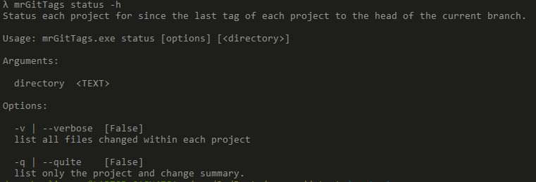
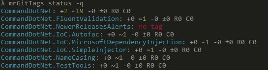
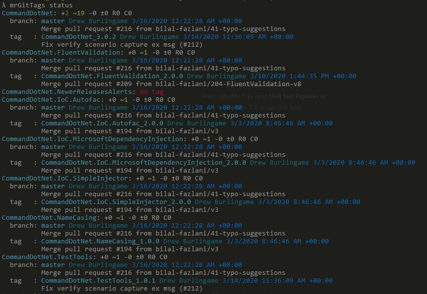
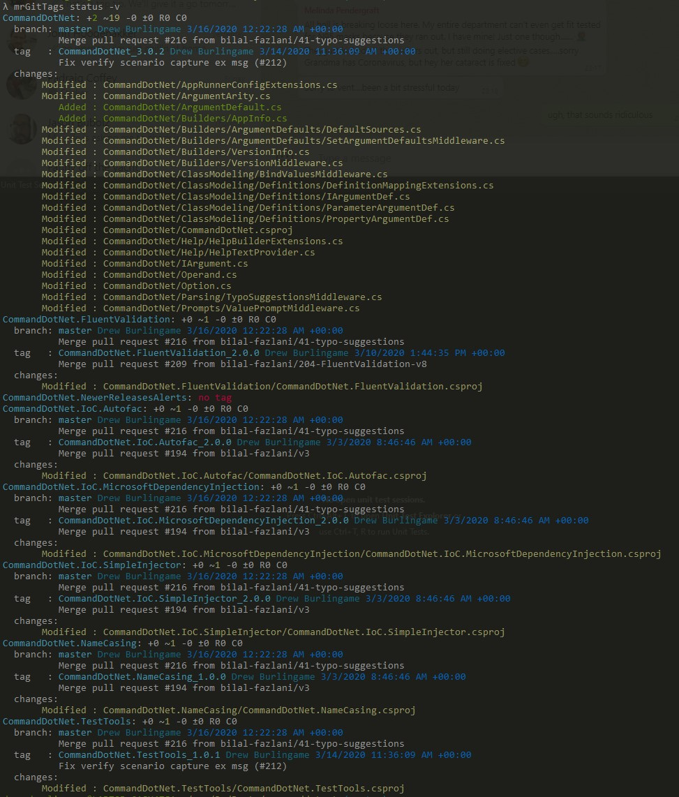

mrGitTags - Mono-Repo Git Tags

# Purpose
This tool helps manage tags for a mono-repo publishing multiple packages.

This tool will report on the status of each project to make it easier to determine when a new package needs to be published for a given project.

# Background

The [CommandDotNet](https://github.com/bilal-fazlani/commanddotnet/) repo publishes multple packages, one per project. 
Tags are used to assign semantic versions to a project, using the format {project_name}_{semver}. 
The CI service triggers a build to deploy a package when a new tag is pushed.

After a few PRs are merged, I generally know which packages I need to increment for semver, but I always end up comparing changes in the different projects since the last tag to see if I missed something.  It's a bit mind-numbing and thus error-prone so I threw together this tool to make it simpler for me.

It was also another opportunity to dog-food CommandDotNet

I got to try out the [Pastel](https://github.com/silkfire/Pastel) package for coloring the output. I think it's my new favorite for that.

Other libraries that made this simple to write:

* [libgit2sharp](https://github.com/libgit2/libgit2sharp)
* [morelinq](https://github.com/morelinq/MoreLINQ)
* [Semver](https://github.com/maxhauser/semver)

# Examples
## Status
### Help

### Quite

### Default

### Verbose
